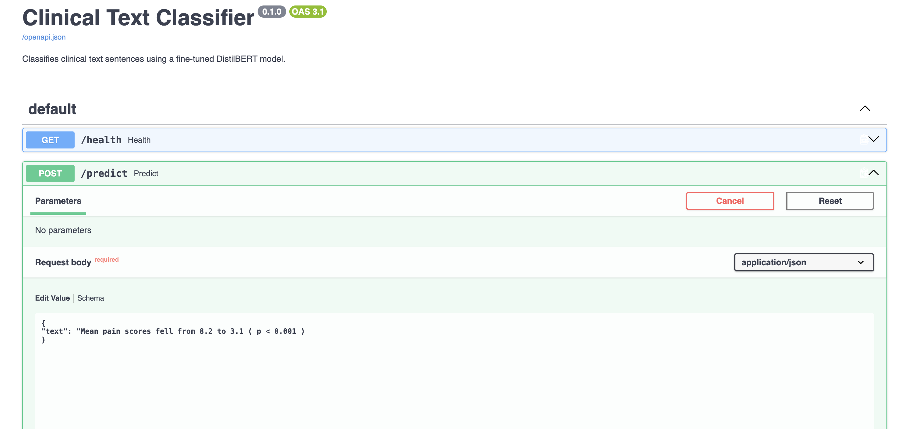
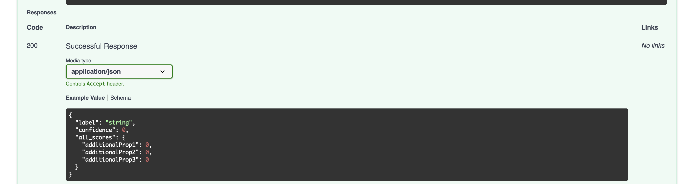

# Clinical Text Classifier


Takes one sentence from a medical research abstract and predicts which part of
the abstract it belongs to: `background`, `objective`, `methods`, `results`, or
`conclusions`. It's a fine-tuned DistilBERT model behind a FastAPI service,
running on AWS.

**Live:** http://107.21.9.181/docs

## Why I built this

I'm trying to move into ML / ML-infra work, and most of what I'd done before
was Jupyter notebooks that never left my laptop. I wanted one project that goes
the whole way — raw dataset, to a trained model, to a running API on a cloud
server with tests and CI — because "everything after the notebook" was exactly
the part I hadn't practiced.

So the model itself is intentionally plain: a small BERT, a standard fine-tune,
no clever tricks. The part I cared about is everything around it — the data
abstraction, experiment tracking, the container, the Terraform, the deploy
pipeline.

## What it does

[PubMed 20k RCT](https://huggingface.co/datasets/armanc/pubmed-rct20k) is
~200k sentences pulled from the abstracts of randomized controlled trials, each
labelled with its role. Given:

> Patients were randomly assigned to prednisolone or placebo .

the model returns:

```bash
curl -X POST http://107.21.9.181/predict \
  -H 'Content-Type: application/json' \
  -d '{"text": "Mean pain scores fell from 8.2 to 3.1 ( p < 0.001 ) ."}'

# {"label": "results", "confidence": 0.997, "all_scores": { ... }}
```

Or in the browser — FastAPI's auto-generated docs at
[`/docs`](http://107.21.9.181/docs), where you can send requests with
"Try it out":





## Results

Held-out test split, 29,578 sentences the model never saw:

| model | accuracy | macro F1 |
| --- | --- | --- |
| TF-IDF + logistic regression (baseline) | 82.2% | 0.753 |
| DistilBERT, single sentence | 86.6% | 0.806 |

A bag-of-words baseline already gets 82% — a lot of this task is just which
words appear (numbers and "p <" point at `results`, "we conclude" points at
`conclusions`). DistilBERT adds ~4 points on top of that, from word order and
phrasing. Both models are weakest on the same two classes, `objective` and
`background`: short, general sentences at the top of an abstract where the line
between "here's the problem" and "here's what we tested" is genuinely blurry.

Per-class numbers, confusion matrix and failure examples are in
**[docs/evaluation.md](docs/evaluation.md)** (DistilBERT) and
**[docs/baseline.md](docs/baseline.md)** (baseline).

Published results on this dataset reach ~92% by giving the model the
surrounding sentences as context instead of one sentence at a time — that's the
next experiment.

## How it's put together

```
src/data/loader.py    the only file that knows anything dataset-specific
src/train.py           fine-tune + log params/metrics/model to MLflow
src/api/main.py         FastAPI wrapper around the saved checkpoint
scripts/evaluate.py     regenerates docs/evaluation.md + the confusion matrix
infra/                  Terraform for the EC2 instance + security group
.github/workflows/      test -> build image -> push to GHCR -> deploy to EC2
```

**The data loader is deliberately isolated.** Right now it loads PubMed 20k
RCT; the plan is to retrain on MIMIC-III once my PhysioNet access comes
through. Everything dataset-specific — source, column names, the label list —
sits behind one `load_dataset(name)` that returns a standard `DatasetBundle`.
Training, serving and the tests never import a dataset directly, so switching
datasets is a new function in one file, not a rewrite.

**Why DistilBERT and not LoRA / a big LLM.** DistilBERT is 66M parameters,
small enough to fully fine-tune on a laptop GPU. LoRA / QLoRA exist to make
fine-tuning possible for models too big to fit in memory otherwise — a real
problem for an 8B model, not for this one. (I've got a separate project using
QLoRA where it actually matters.)

**Why EC2 and not something serverless.** Mostly to learn the
EC2 / security-group / SSH side of things, since that's what a lot of job
postings list. It's a `t3.micro` on the free tier with a 2 GB swapfile so the
model load doesn't OOM. `terraform destroy` removes everything.

## Running it locally

```bash
python -m venv .venv && source .venv/bin/activate
pip install -r requirements.txt

# train (logs to MLflow — view with `mlflow ui --port 5001`)
python -m src.train --dataset pubmed_20k_rct --epochs 3

# serve the trained model
uvicorn src.api.main:app --reload

# tests
pytest                  # unit only
pytest -m integration   # also downloads the real dataset
```

Docker (the image is code-only — the model is mounted at runtime so builds stay
small):

```bash
docker build -t clinical-text-classifier .
docker run -p 8000:8000 \
  -v "$(pwd)/model_output/final:/app/model_output/final:ro" \
  clinical-text-classifier
```

## Deployment

A push to `main` triggers GitHub Actions: run the tests, build a CPU-only
`linux/amd64` image, push it to GHCR, then SSH into the EC2 box, pull, and
restart the container with a health check. The model file lives on the instance
and is bind-mounted into the container. Infra is all in
[`infra/`](infra/) — `terraform apply` to stand it up, `terraform destroy` to
tear it down.

## Known limitations

- **Single-sentence context** — ~86% here vs ~92% with surrounding sentences.
  Biggest lever for a v2.
- **DistilBERT is small on purpose** — a bigger model would likely do better;
  that wasn't the point.
- **HTTP, not HTTPS**, and the URL is a bare IP that changes if the instance
  restarts. Fine for a demo; a real service would want a domain + TLS.
- **`t3.micro`** handles one request at a time comfortably and not much more.
- **MIMIC-III loader is a stub** — waiting on PhysioNet credentialing. That's
  the planned next dataset.

## Tech

Python · PyTorch · Hugging Face Transformers · scikit-learn · MLflow · FastAPI ·
Docker · Terraform · AWS EC2 · GitHub Actions
