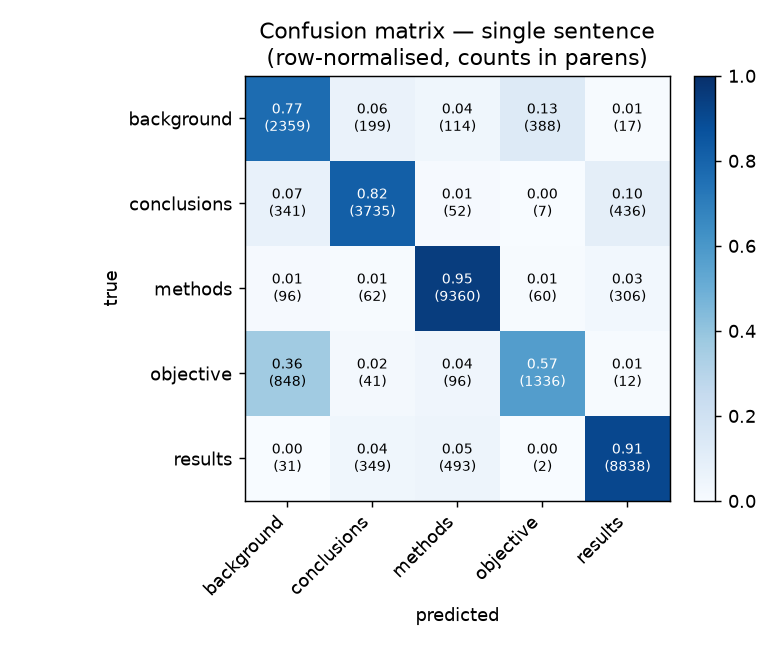

# Evaluation — single sentence

`distilbert-base-uncased`, fully fine-tuned for 3 epochs on `pubmed_20k_rct`. Evaluated on the full test split (29,578 sentences held out from training).

Generated by `python -m scripts.evaluate` (see the header for the exact command). Deployed model = single sentence; the context variant is a documented experiment, not deployed.

## Headline

| metric | value |
| --- | --- |
| accuracy | 0.866 |
| macro F1 | 0.806 |
| mean confidence when right | 0.950 |
| mean confidence when wrong | 0.792 |

## Per-class

| class | precision | recall | f1 | support |
| --- | --- | --- | --- | --- |
| background | 0.642 | 0.767 | 0.699 | 3,077 |
| conclusions | 0.852 | 0.817 | 0.834 | 4,571 |
| methods | 0.925 | 0.947 | 0.936 | 9,884 |
| objective | 0.745 | 0.573 | 0.648 | 2,333 |
| results | 0.920 | 0.910 | 0.915 | 9,713 |

## Confusion matrix

## Notes

- Easiest class: `methods` (F1 0.94). Hardest: `objective` (F1 0.65).
- Most common mistake: `objective` predicted as `background` (848 sentences).
- Calibration: mean confidence 0.95 when right vs 0.79 when wrong, so a confidence threshold could hold back uncertain predictions for review.

## Highest-confidence mistakes

| true | predicted | conf | sentence |
| --- | --- | --- | --- |
| methods | results | 1.00 | ( @ ) In the MIA group and ADA group , after surgery , the increased dosage of fentanyl citrate was less than … |
| background | results | 1.00 | However , the subgroup of subjects , which inhaled UFP during the first exposure , exhibited a significant inc… |
| conclusions | results | 1.00 | Rifampicin significantly increased the mean area under the plasma concentration-time curve ( AUC ) of ( R ) - … |
| methods | results | 1.00 | No pain was reported in the saffron group , whereas the indomethacin group experienced pain before @ hours ( P… |
| objective | conclusions | 1.00 | Once-daily losartan reduces BP in a dose-dependent manner and is well tolerated in hypertensive children aged … |
| conclusions | results | 1.00 | PDT was associated with a significant decrease in bleeding scores ( P = @ ) as well as inflammatory exudation … |
