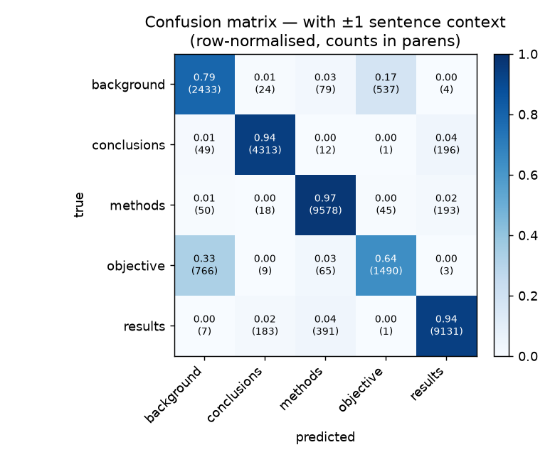

# Evaluation — with ±1 sentence context

`distilbert-base-uncased`, fully fine-tuned for 3 epochs on `pubmed_20k_rct_context`. Evaluated on the full test split (29,578 sentences held out from training).

Generated by `python -m scripts.evaluate` (see the header for the exact command). Deployed model = single sentence; the context variant is a documented experiment, not deployed.

## Headline

| metric | value |
| --- | --- |
| accuracy | 0.911 |
| macro F1 | 0.858 |
| mean confidence when right | 0.979 |
| mean confidence when wrong | 0.856 |

## Per-class

| class | precision | recall | f1 | support |
| --- | --- | --- | --- | --- |
| background | 0.736 | 0.791 | 0.762 | 3,077 |
| conclusions | 0.949 | 0.944 | 0.946 | 4,571 |
| methods | 0.946 | 0.969 | 0.957 | 9,884 |
| objective | 0.718 | 0.639 | 0.676 | 2,333 |
| results | 0.958 | 0.940 | 0.949 | 9,713 |

## Confusion matrix

## Notes

- Easiest class: `methods` (F1 0.96). Hardest: `objective` (F1 0.68).
- Most common mistake: `objective` predicted as `background` (766 sentences).
- Calibration: mean confidence 0.98 when right vs 0.86 when wrong, so a confidence threshold could hold back uncertain predictions for review.

## Highest-confidence mistakes

| true | predicted | conf | sentence |
| --- | --- | --- | --- |
| results | conclusions | 1.00 | They also reported improvement in skin appearance and breast hardness over time ( p < @ ) , with no significan… |
| results | conclusions | 1.00 | Apart from using conventional rather than gravitational valves , longer duration of surgery and female sex wer… |
| results | conclusions | 1.00 | Findings suggest that POWeR is acceptable and potentially effective . [SEP] Providing human support enhanced u… |
| objective | conclusions | 1.00 | Headache may be relieved after anterior cervical discectomy , but the mechanism is unknown . [SEP] If headache… |
| results | conclusions | 1.00 | Secondary outcomes are the rate of complications , mainly infection , hematoma , burst abdomen , pain , and re… |
| results | conclusions | 1.00 | The most commonly reported symptom cluster was of the nose ( @ % ) . [SEP] Blinding to exposure is generally e… |
